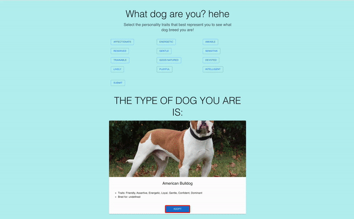
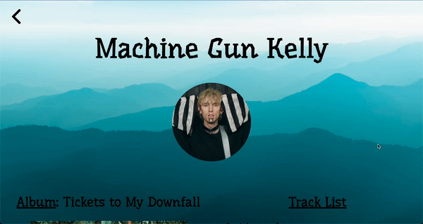

# Snap-Inc-Projects
Here are the various projects that I completed during my time at Snap Inc. as a Snap Engineering Academy Scholar! 👻
*May take a few moments to load images*
## Capstone Project

### #1 Prototype Snapchat Feature "Snap Hugs" ✊
~ | Overview |
|---|---|
**Sample** |  | 

~ | Stories | Industry Insights | Get Involved | Beta Testing |
|-|-----|-----|-----|-----|
**Features** |  |  |  |  |

**Tools**: [React Native](https://reactnative.dev/), [Expo](https://expo.dev/), [Google Firebase](https://firebase.google.com/): [Cloud Firestore](https://firebase.google.com/docs/firestore) & [Authentication](https://firebase.google.com/docs/auth)

**GitHub**: https://github.com/jsi19/Snap-Hugs

## Mini Projects

~ | #2 Dog Picker | #3 Machine Gun Kelly Website |
:-------------------------:|:-------------------------:|:-------------------------:|
**Sample** |  | |
**Tools** | [React.js](https://reactjs.org/), [Material UI](https://mui.com/), [Postman(APIs)](https://www.postman.com/) | [HTML](https://developer.mozilla.org/en-US/docs/Web/HTML)/[CSS](https://developer.mozilla.org/en-US/docs/Web/CSS)/[JS](https://www.javascript.com/)
**GitHub** | [Dog Picker Repo](https://github.com/Snap-Engineering-Academy-2022/Jonathan-DogPicker) | [Machine Gun Kelly Repo](https://github.com/Snap-Engineering-Academy-2022/classwebsite/tree/main/Jonathan) |
